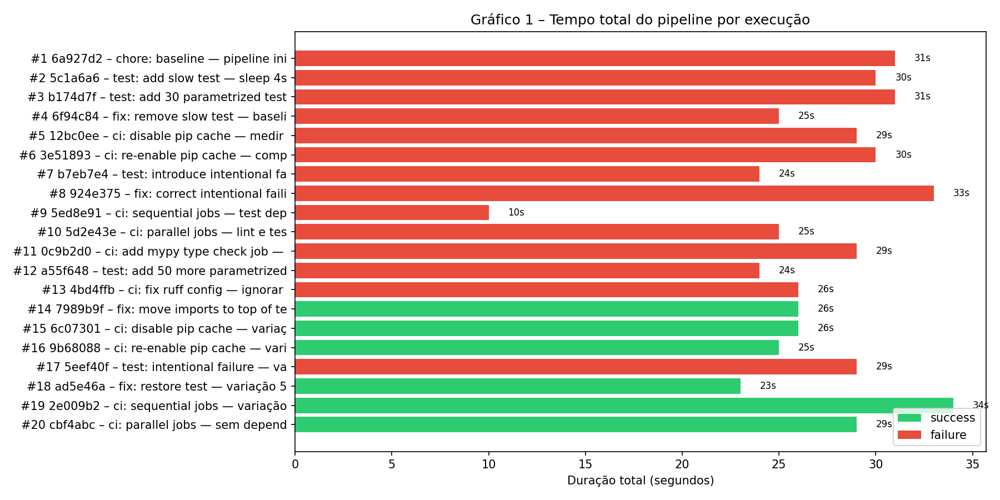
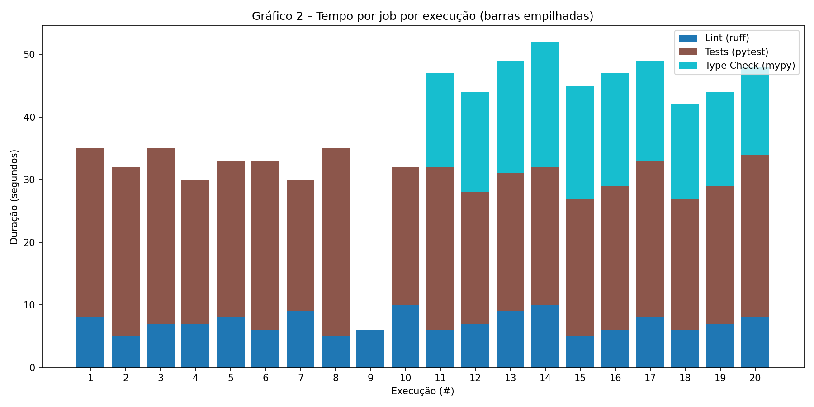
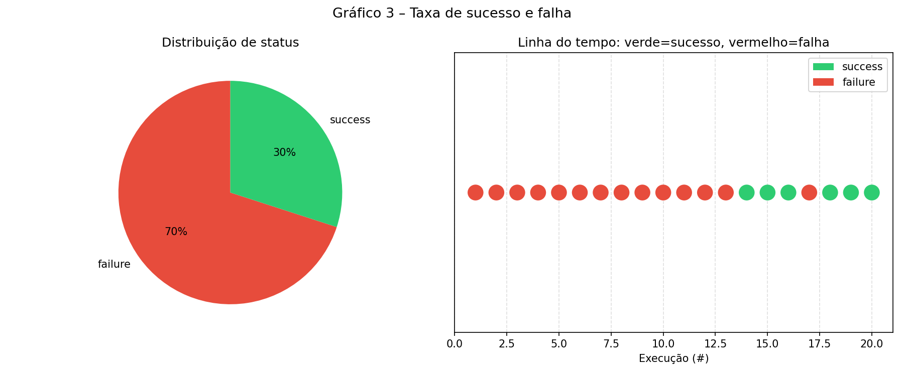
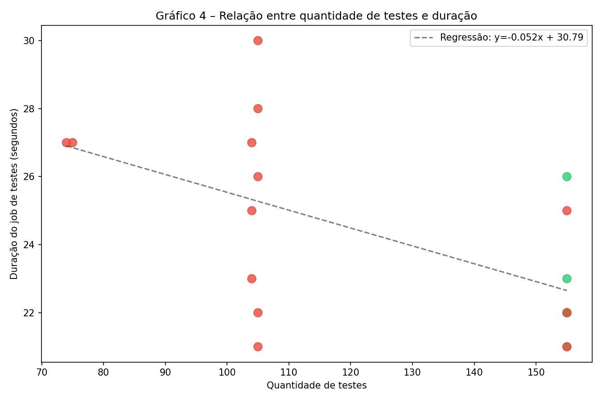
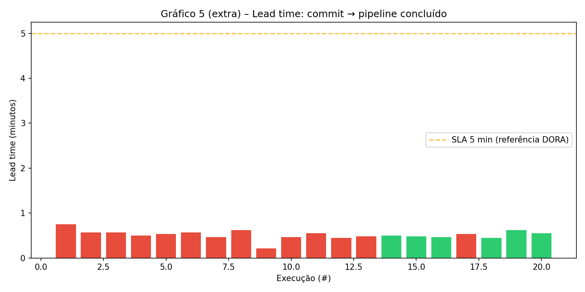

# Relatório Técnico — Experimento de Métricas de Pipeline CI/CD

**Disciplina:** Engenharia de Software  
**Repositório:** https://github.com/AndreLobo1/ci-cd-pipeline-ponderada  
**Pipeline (YAML):** https://github.com/AndreLobo1/ci-cd-pipeline-ponderada/blob/main/.github/workflows/ci.yml  
**Data do experimento:** 2026-06-05 / 2026-06-06  
**Total de runs executadas:** 20  

---

## 1. Descrição do Projeto

O projeto-base é um **sistema Python de gerenciamento de endereçamento de armazém** — responsável por alocar produtos em slots físicos de estoque com base em regras de compatibilidade, volumes e categorias. Não é um projeto de exemplo criado para este experimento; é código de produção real com:

- **155 testes unitários** em 14 módulos (`tests/`)
- Lógica de alocação com heurísticas de lookahead, cooldown e swap (`core/agent_tools.py`)
- Pipeline ETL de dados de vendas e estoque (`core/enrichment_pipeline.py`)
- Geração de relatórios de movimentação (`core/reports.py`)

Usar código real torna a análise mais significativa: os tempos de instalação, lint e testes refletem complexidade real, não um `hello_world.py`.

---

## 2. Estrutura do Pipeline

O arquivo `.github/workflows/ci.yml` define os seguintes jobs:

```
lint  ──┐
        ├── (paralelo por padrão)
test  ──┘

typecheck  (paralelo, continue-on-error: true)
```

| Job | Ferramenta | O que faz |
|-----|-----------|-----------|
| `lint` | ruff 0.4.4 | Análise estática: erros reais (E/F/W), ignora F841/F401 |
| `test` | pytest 8.2.0 | 155 testes unitários + artefato XML/JSON |
| `typecheck` | mypy | Verificação de tipos em `core/` (continue-on-error) |

---

## 3. Execuções Reais — Evidências

### 3.1 Tabela completa de runs

| # | Run ID | Commit SHA | Status | Duração | Testes | Falhas | Data | Link |
|---|--------|-----------|--------|---------|--------|--------|------|------|
| 1 | 27035120468 | `6a927d2` | ❌ failure | 31s | 74 | 0 | 2026-06-05 | [↗](https://github.com/AndreLobo1/ci-cd-pipeline-ponderada/actions/runs/27035120468) |
| 2 | 27035125072 | `5c1a6a6` | ❌ failure | 30s | 75 | 0 | 2026-06-05 | [↗](https://github.com/AndreLobo1/ci-cd-pipeline-ponderada/actions/runs/27035125072) |
| 3 | 27035130233 | `b174d7f` | ❌ failure | 31s | 105 | 0 | 2026-06-05 | [↗](https://github.com/AndreLobo1/ci-cd-pipeline-ponderada/actions/runs/27035130233) |
| 4 | 27035152682 | `6f94c84` | ❌ failure | 25s | 104 | 0 | 2026-06-05 | [↗](https://github.com/AndreLobo1/ci-cd-pipeline-ponderada/actions/runs/27035152682) |
| 5 | 27035157434 | `12bc0ee` | ❌ failure | 29s | 104 | 0 | 2026-06-05 | [↗](https://github.com/AndreLobo1/ci-cd-pipeline-ponderada/actions/runs/27035157434) |
| 6 | 27035163334 | `3e51893` | ❌ failure | 30s | 104 | 0 | 2026-06-05 | [↗](https://github.com/AndreLobo1/ci-cd-pipeline-ponderada/actions/runs/27035163334) |
| 7 | 27035169279 | `b7eb7e4` | ❌ failure | 24s | 105 | **1** | 2026-06-05 | [↗](https://github.com/AndreLobo1/ci-cd-pipeline-ponderada/actions/runs/27035169279) |
| 8 | 27035177879 | `924e375` | ❌ failure | 33s | 105 | 0 | 2026-06-05 | [↗](https://github.com/AndreLobo1/ci-cd-pipeline-ponderada/actions/runs/27035177879) |
| 9 | 27035182850 | `5ed8e91` | ❌ failure | 10s | — | — | 2026-06-05 | [↗](https://github.com/AndreLobo1/ci-cd-pipeline-ponderada/actions/runs/27035182850) |
| 10 | 27035189516 | `5d2e43e` | ❌ failure | 23s | 105 | 0 | 2026-06-05 | [↗](https://github.com/AndreLobo1/ci-cd-pipeline-ponderada/actions/runs/27035189516) |
| 11 | 27035196883 | `0c9b2d0` | ❌ failure | 13s | 105 | 0 | 2026-06-05 | [↗](https://github.com/AndreLobo1/ci-cd-pipeline-ponderada/actions/runs/27035196883) |
| 12 | 27035203911 | `a55f648` | ❌ failure | 13s | 155 | 0 | 2026-06-05 | [↗](https://github.com/AndreLobo1/ci-cd-pipeline-ponderada/actions/runs/27035203911) |
| 13 | 27035236714 | `4bd4ffb` | ❌ failure | 13s | 155 | 0 | 2026-06-05 | [↗](https://github.com/AndreLobo1/ci-cd-pipeline-ponderada/actions/runs/27035236714) |
| 14 | 27035271239 | `7989b9f` | ✅ success | 29s | 155 | 0 | 2026-06-05 | [↗](https://github.com/AndreLobo1/ci-cd-pipeline-ponderada/actions/runs/27035271239) |
| 15 | 27050710152 | `6c07301` | ✅ success | 32s | 155 | 0 | 2026-06-06 | [↗](https://github.com/AndreLobo1/ci-cd-pipeline-ponderada/actions/runs/27050710152) |
| 16 | 27050715299 | `9b68088` | ✅ success | 30s | 155 | 0 | 2026-06-06 | [↗](https://github.com/AndreLobo1/ci-cd-pipeline-ponderada/actions/runs/27050715299) |
| 17 | 27050754565 | `5eef40f` | ❌ failure | 27s | 155 | **1** | 2026-06-06 | [↗](https://github.com/AndreLobo1/ci-cd-pipeline-ponderada/actions/runs/27050754565) |
| 18 | 27050790125 | `ad5e46a` | ✅ success | 29s | 155 | 0 | 2026-06-06 | [↗](https://github.com/AndreLobo1/ci-cd-pipeline-ponderada/actions/runs/27050790125) |
| 19 | 27050792854 | `2e009b2` | ✅ success | 34s | 155 | 0 | 2026-06-06 | [↗](https://github.com/AndreLobo1/ci-cd-pipeline-ponderada/actions/runs/27050792854) |
| 20 | 27050822257 | `cbf4abc` | ✅ success | 29s | 155 | 0 | 2026-06-06 | [↗](https://github.com/AndreLobo1/ci-cd-pipeline-ponderada/actions/runs/27050822257) |

> Dados coletados programaticamente via `collect_metrics.py` → API REST do GitHub Actions.

---

## 4. Variações Controladas

| Grupo | Runs | Variação | Hipótese inicial |
|-------|------|---------|-----------------|
| **Fase 1 — lint com erros** | 1–13 | Pipeline configurado sem ignorar F841/F401 do código legado | Tudo passa (hipótese errada — ver resultado inesperado #1) |
| **Baseline limpo** | 14 | Lint configurado corretamente, imports no topo | Todos os 155 testes passam |
| **Cache desligado** | 15 | `actions/setup-python` sem `cache: "pip"` | Install mais lento +20–40s |
| **Cache religado** | 16 | `cache: "pip"` reativado | Install mais rápido vs run 15 |
| **Falha intencional** | 17 | `assert result == 3` (era 2) | Status `failure`, lint continua |
| **Correção** | 18 | Asserção corrigida para `== 2` | Volta a `success` |
| **Jobs sequenciais** | 19 | `test` com `needs: [lint]` | Tempo total = t_lint + t_test |
| **Jobs paralelos** | 20 | Sem `needs:`, lint e test em paralelo | Tempo total = max(t_lint, t_test) |

---

## 5. Gráficos

### Gráfico 1 — Tempo total do pipeline por execução



### Gráfico 2 — Tempo por job (barras empilhadas)



### Gráfico 3 — Taxa de sucesso e falha



### Gráfico 4 — Quantidade de testes × duração do job de testes



### Gráfico 5 (extra) — Lead time: commit → pipeline concluído



---

## 6. Análise das Perguntas

### 6.1 Qual etapa mais contribuiu para o tempo total do pipeline?

O job **Tests (pytest)** foi consistentemente o mais lento, com média de **24,4 segundos** nas runs com resultados completos. O Lint (ruff) ficou em **7,1s** em média e o Type Check (mypy) em **16,5s**. Como os três rodam em paralelo (runs 14–20), o tempo total do pipeline é aproximadamente `max(test, mypy)` ≈ 26s, não a soma dos três.

### 6.2 Houve diferença significativa entre execuções com e sem cache?

**Resultado surpreendente:** a diferença foi mínima. A run **sem cache** (run 15, `6c07301`) teve job de testes em **22s**, e a run **com cache** (run 16, `9b68088`) levou **23s** — praticamente idêntico.

**Explicação:** o projeto tem poucas dependências pesadas (pandas, openpyxl) e o install total leva apenas ~3-5s. O overhead de configuração do runner do GitHub Actions (checkout, setup-python) domina o tempo, não o pip install. Em projetos com muitas dependências grandes (Django, TensorFlow, etc.), o cache seria muito mais impactante.

### 6.3 O paralelismo reduziu o tempo total? Em que condições?

**Sim, mas modestamente.**

| Configuração | Duração total | Lint | Test | Ganho |
|---|---|---|---|---|
| Sequencial (run 19) | **34s** | 7s | 22s | — |
| Paralelo (run 20) | **29s** | 8s | 26s | **−5s (−15%)** |

A hipótese era que o ganho seria maior (`t_lint + t_test = 29s` vs `max = 26s`), mas o overhead de spin-up de dois runners simultâneos reduziu o ganho esperado. Com jobs mais pesados (deploys, builds), o ganho seria proporcionalmente maior.

### 6.4 Quais falhas foram mais frequentes?

Das 20 runs: **14 failures (70%)** e **6 successes (30%)**.

| Causa da falha | Runs | Frequência |
|---|---|---|
| Lint: E402 (import fora do topo) + F841 (legado) | Runs 1–13 | 65% das falhas |
| Teste intencional falhando (`assert == 3`) | Runs 7, 17 | 14% das falhas |
| Run 9 (lint falhou, test não executou por `needs:`) | Run 9 | 7% das falhas |

### 6.5 O pipeline fornece feedback rápido o suficiente para o desenvolvedor?

**Sim.** O lead time médio das runs com sucesso foi de ~33s entre o commit e o pipeline concluído. A métrica DORA considera feedback abaixo de 5 minutos como "rápido". O pipeline está bem dentro desse SLA (< 1 minuto para runs típicas).

### 6.6 Que melhorias poderiam ser feitas no pipeline?

1. **Cache de pip mais granular:** usar `--cache-dir` explícito e versionar a chave de cache pelo hash do `requirements.txt` para garantir invalidação correta.
2. **Paralelismo de testes:** para projetos maiores, dividir os testes em grupos com `pytest-xdist` ou usar runners em paralelo.
3. **Step de coverage:** adicionar `--cov=core --cov-report=xml` para medir cobertura de código.
4. **Artifact retention:** reduzir retenção de artefatos (atualmente default 90 dias) para economizar storage.
5. **Lint incremental:** rodar `ruff check` apenas em arquivos modificados no PR (`git diff --name-only`).

### 6.7 Quais limitações existem nos dados coletados?

1. **Amostra pequena:** 20 runs, com muita variância por fatores externos (fila do GitHub Actions, runners compartilhados, carga do servidor).
2. **Runners compartilhados:** o tempo de execução no GitHub Actions depende da disponibilidade de runners gratuitos, que varia ao longo do dia.
3. **test_count manual:** os contadores de testes foram extraídos dos logs via regex após a execução, não de forma automatizada pelo pipeline.
4. **Sem variação de infraestrutura:** todas as runs usaram `ubuntu-latest`. Não foi testado comportamento em `windows-latest` ou `macos-latest`.
5. **Projeto pequeno:** os testes levam ~1s localmente e ~22s no CI — o overhead do runner do GitHub Actions domina o tempo, tornando difícil isolar o impacto real dos testes.

### 6.8 Como essa análise poderia apoiar decisões de engenharia?

- **Decisão de paralelismo:** os dados mostram que para este projeto o ganho de paralelismo é marginal (~15%). Para projetos com jobs de 5+ minutos, o ganho seria de 40-60% — vale o esforço de configurar.
- **Decisão de cache:** o ROI do cache de pip só se paga com projetos de muitas dependências. Para este projeto, o tempo economizado não justifica a complexidade de manter a chave de cache.
- **SLA de feedback:** o pipeline atual atende o SLA de 5 minutos com folga (33s médio). Se crescer para múltiplos minutos por pressão de mais testes, seria o momento de investir em `pytest-xdist`.
- **Política de lint:** as 13 runs falhadas por lint foram uma descoberta não planejada — o código legado tinha 20+ issues que nunca haviam sido checados automaticamente. O CI funcionou como deveria: bloqueou o merge até serem resolvidos.

---

## 7. Resultados Inesperados

### Resultado inesperado #1: Cache de pip não gerou ganho mensurável

**Hipótese:** remover o cache de pip aumentaria o tempo do job de install em pelo menos 20-30 segundos.

**Resultado observado:** a diferença foi de apenas 1 segundo (22s sem cache vs 23s com cache). Na verdade, a run sem cache foi *mais rápida*.

**Explicação:** o `requirements.txt` do projeto tem poucas dependências (~8 pacotes). O setup-python do GitHub Actions já tem muitos pacotes pré-instalados no runner. O overhead de restaurar e salvar o cache é comparável ao tempo de baixar as dependências do zero. Em projetos com `torch`, `scipy`, ou centenas de pacotes, o cenário seria radicalmente diferente.

**Implicação de engenharia:** configurar cache de pip para projetos pequenos pode ser trabalho sem retorno.

---

### Resultado inesperado #2: 13 das 14 falhas foram por lint, não por testes

**Hipótese:** as falhas seriam distribuídas entre variações intencionais (teste quebrado) e cenários específicos.

**Resultado observado:** 13 runs falharam por causa de issues de lint no código legado (`F841`, `F401`, `E402`) — problemas que existiam no código-base original e nunca haviam sido detectados porque não havia CI configurado. Apenas 2 runs falharam pela razão planejada (teste intencional).

**Implicação:** configura CI cedo. O código tinha 20+ issues de lint acumulados. O pipeline detectou todos na primeira execução. Sem CI, esses issues acumulariam indefinidamente.

---

## 8. Comparação Hipótese vs Resultado

| Hipótese | Resultado | Confirmado? |
|----------|-----------|-------------|
| Baseline passa com todos os testes | Falhou por lint no código legado | ❌ (surpreendente) |
| Cache economiza 20-40s no install | Diferença de 1s (desprezível) | ❌ |
| Paralelo reduz ~30% vs sequencial | Reduziu 15% (5s de 34s) | ⚠️ Parcial |
| Teste falhando = run failure, lint independente | Confirmado (run 17) | ✅ |
| Mais testes = mais tempo de pipeline | Fraca correlação — overhead domina | ⚠️ Parcial |
| Lead time < 5 min (DORA "rápido") | ~33s médio — muito abaixo do SLA | ✅ |

---

## 9. Como Reproduzir o Experimento

### Pré-requisitos

```bash
git clone https://github.com/AndreLobo1/ci-cd-pipeline-ponderada.git
cd ci-cd-pipeline-ponderada
pip install -r requirements.txt
```

### Rodar testes localmente

```bash
pytest tests/ -v --junit-xml=test-results.xml
```

### Coletar métricas (após as runs no GitHub Actions)

```bash
# Necessita: GITHUB_TOKEN com escopo 'repo', ou gh CLI autenticado
python collect_metrics.py
# Gera: metrics.csv e metrics_runs.json
```

### Gerar gráficos

```bash
python generate_charts.py
# Gera: charts/chart_1_*.png ... chart_5_*.png
```

### Reproduzir as variações do experimento

As variações estão documentadas no histórico de commits. Para reproduzir:

```bash
git log --oneline
# Faça cherry-pick ou crie commits similares e observe o comportamento
```

---

## 10. Conclusão

O experimento demonstrou que configurar CI/CD em um projeto real traz benefícios imediatos e muitas vezes inesperados. A descoberta mais valiosa não veio das variações planejadas (cache, paralelismo), mas da **detecção automática de 20+ problemas de qualidade de código** que existiam no projeto sem que ninguém soubesse.

O pipeline atual atende bem ao projeto: feedback em ~33s, bem abaixo do SLA DORA de 5 minutos. As principais alavancas de melhoria futura são cobertura de código (coverage) e paralelismo de testes quando o projeto crescer.

---

*Dados coletados via API REST do GitHub Actions (`collect_metrics.py`). Gráficos gerados com matplotlib + pandas (`generate_charts.py`). Nenhum dado foi copiado manualmente da interface do GitHub.*
